<br/>
<p align="center">
  <a href="https://github.com/ThatLukaszGuy/DashboardApp">
    
  </a>

  <h3 align="center">Dashboard</h3>

  <p align="center">
    An app allowing the visitor to see his nft's, transactions , balances and even send Ethereum
    <br/>
    <br/>
    <a href="https://dashboard-app-nine-snowy.vercel.app/">View Page</a>
    
  </p>
</p>

     


## Table Of Contents

- [Table Of Contents](#table-of-contents)
- [About The Project](#about-the-project)
- [Built With](#built-with)
- [Images](#images)
- [Getting Started](#getting-started)
  - [Prerequisites](#prerequisites)
  - [Installation](#installation)
- [License](#license)
- [Authors](#authors)

## About The Project

(Now migrated to the Goerli Testnet)

This website can show the user the digital assets he posesses in form of a clear dashboard. It's possible to transfer ETH to other accounts. See NFT's and visit their IPFS uri, see transactions and balances. You can also set ur own username wich will be remembered.

There also 4 tabs in the 'other' section where a user can: access the latest crypto news, all relevant data about a specific coin , see exchanges and all available infos about them, even see graphs and the latest data visualised

The Site is meant to be visited using a pc or laptop. First off, on mobile it's impossible to log in with either MetaMask or Phantom (unless you're using the MetaMask Browser). Second, mobile responsiveness does work although has some issues occur on phones during landscape/horizontal mode due to the svg positioning. Another thing are the charts. For some reason you have to reload the page for them to responsivey resize. They were programmed to be responsive but sadly they do it purely on window size change but an actual reload.

Build on the Moralis.io API 

Relying also on API's from: CoinGecko & CryptoNews 

## Built With


<a href="https://developer.mozilla.org/en-US/docs/Web/JavaScript" target="_blank" rel="noreferrer">  </a>  <a href="https://nextjs.org/" target="_blank" rel="noreferrer">  </a> 

## Images

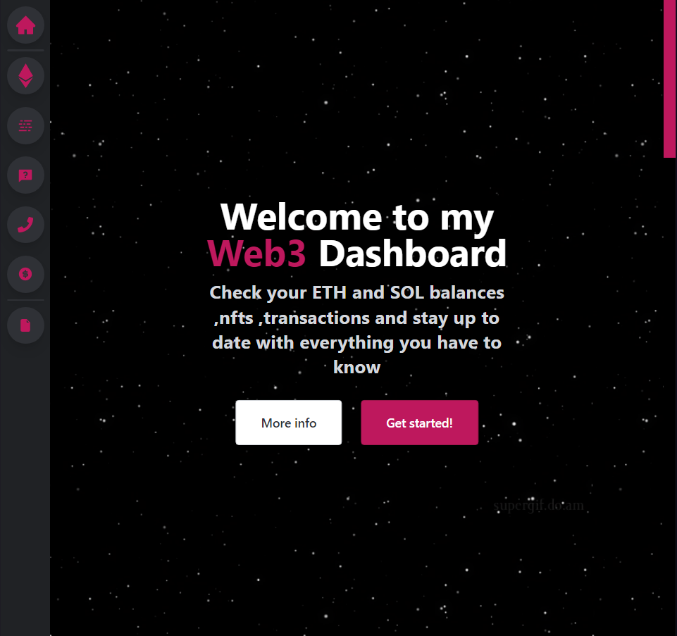

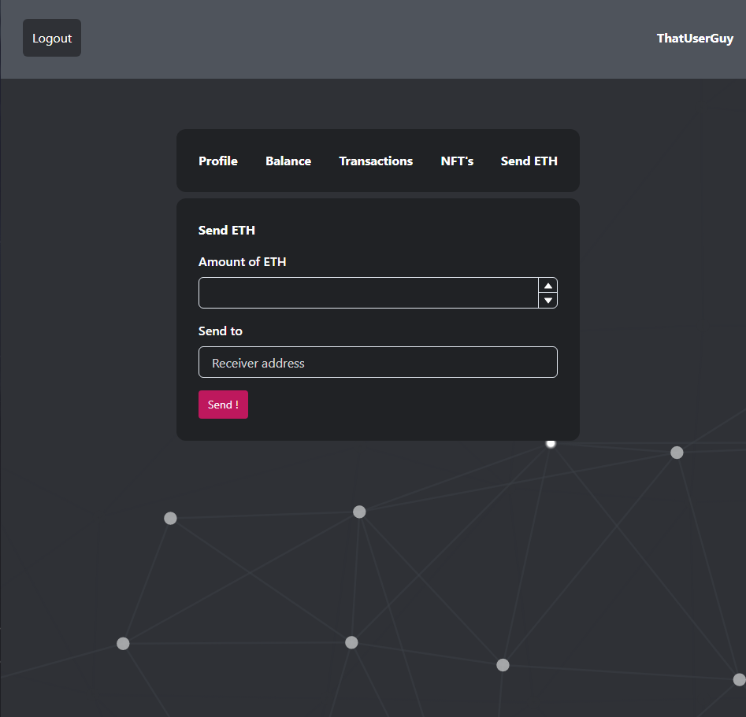

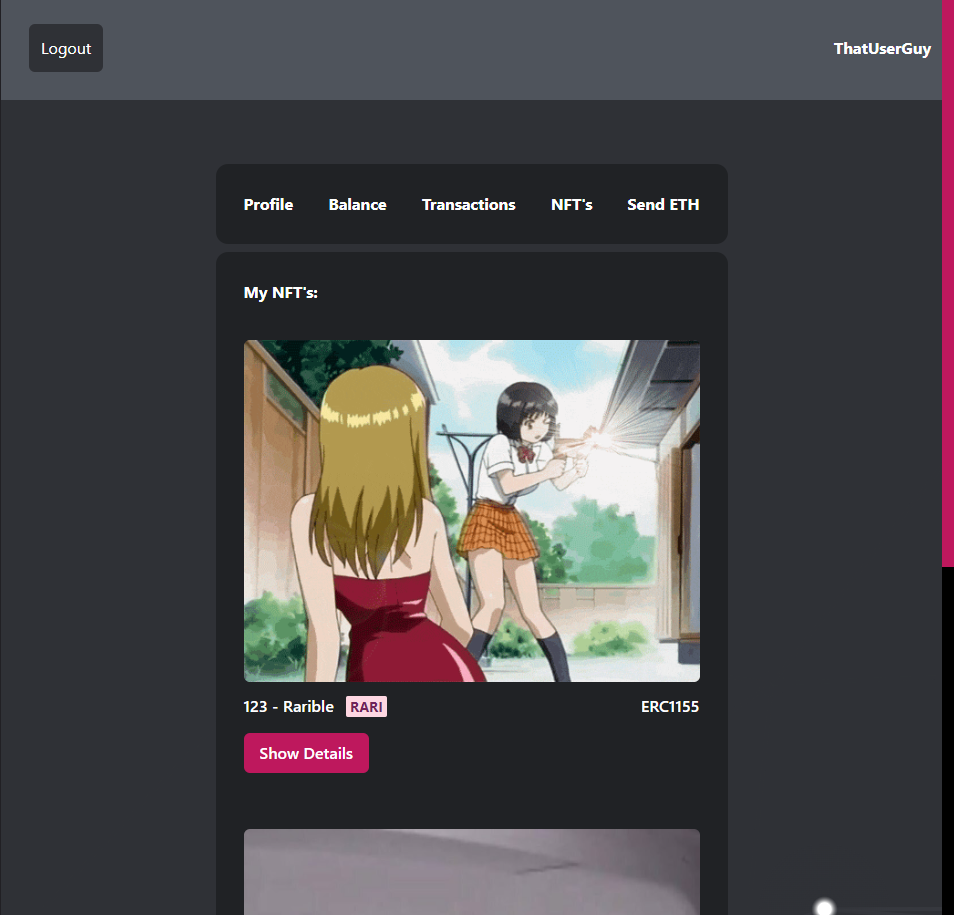

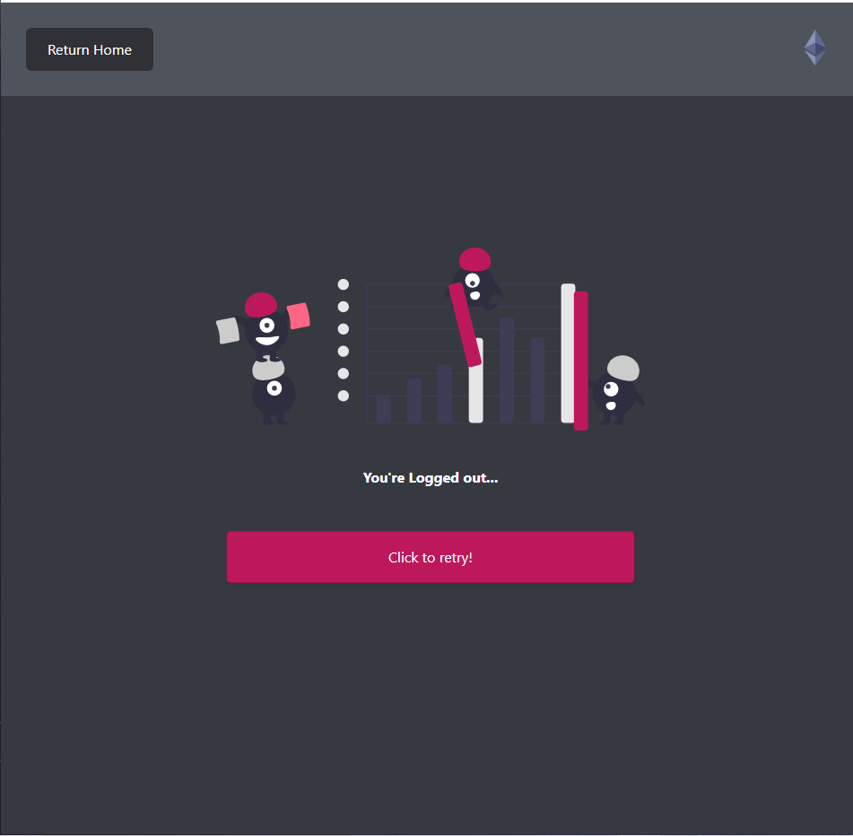

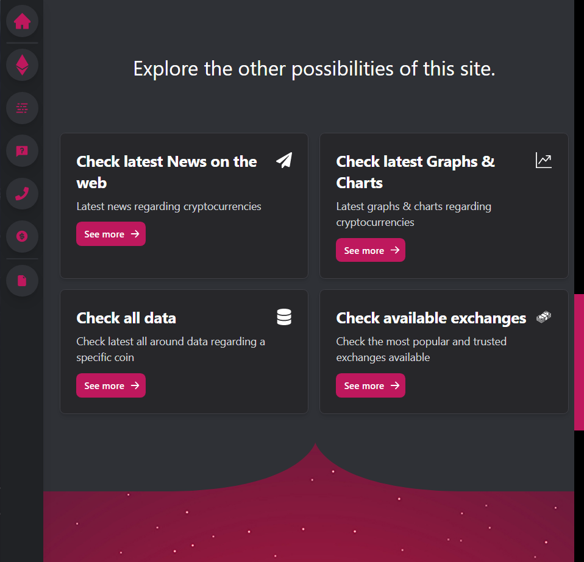

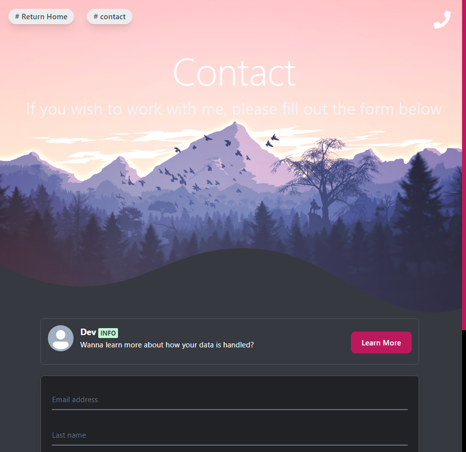

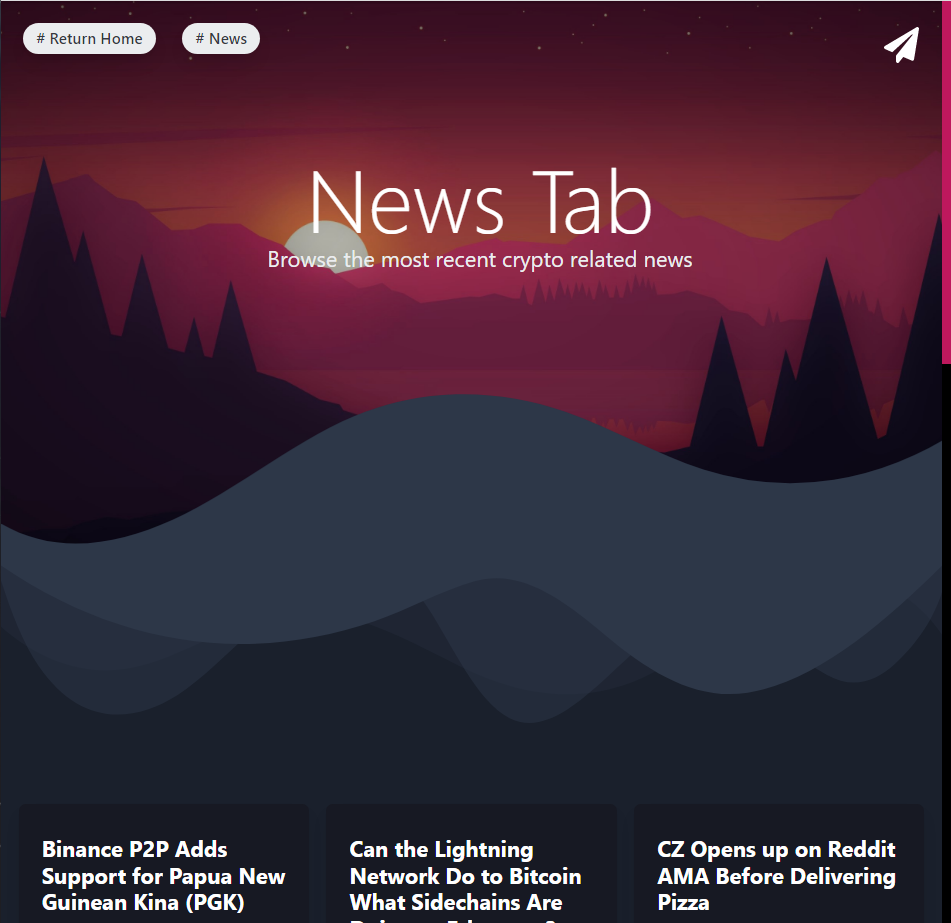


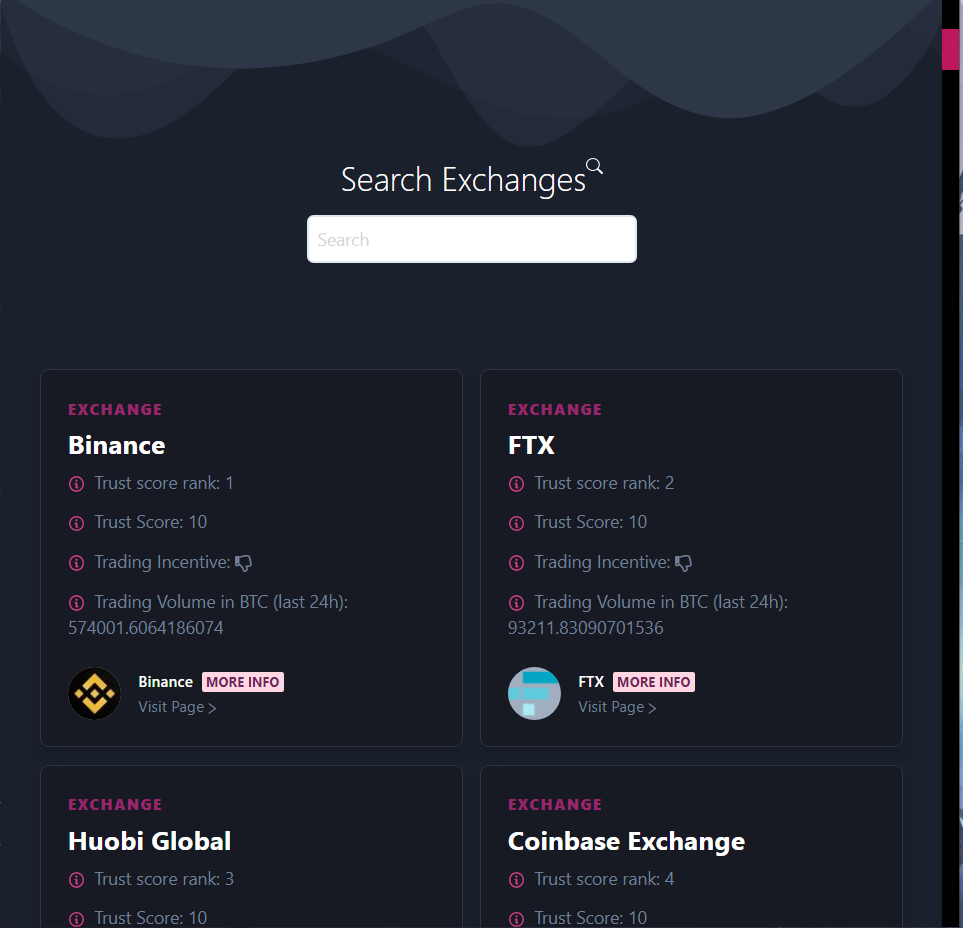

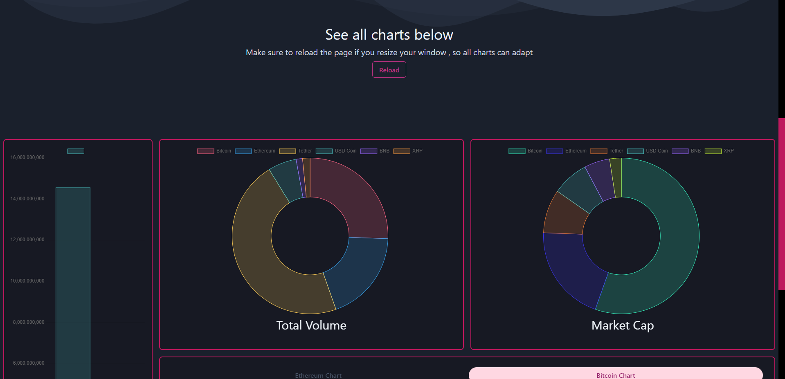

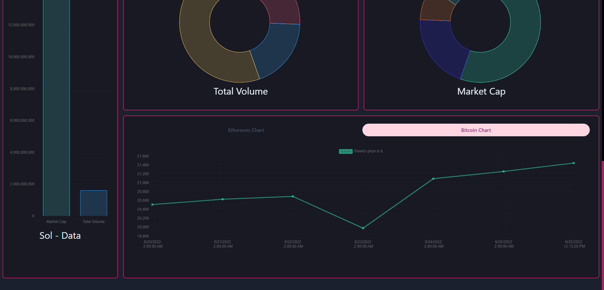

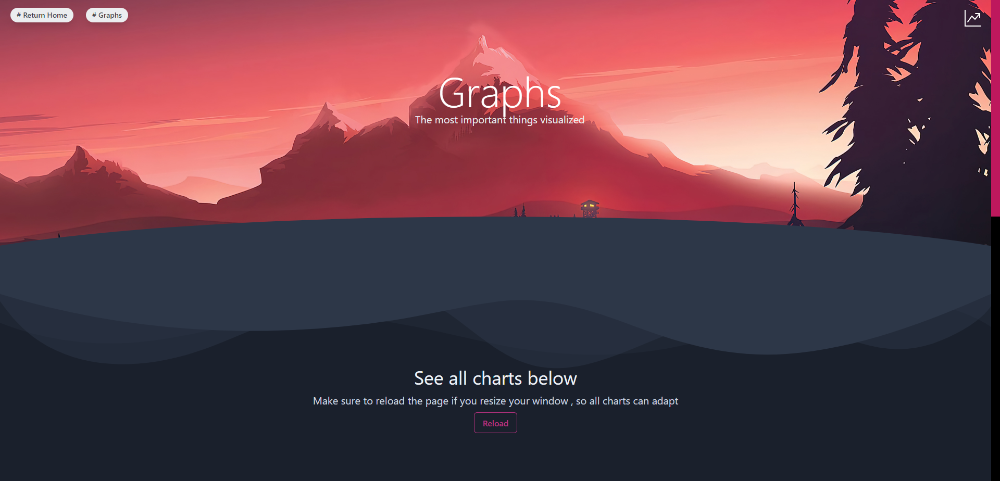


## Getting Started

To run this yourself you have to follow a couple of instructions

### Prerequisites

You will need a package manager (e.g: npm or yarn). A free moralis server for the appID and serverURL. Metamask and/or Phantom wallet required


### Installation

1. Clone Repo

2. Install NPM packages

    ```sh
     npm i
     ```

3. Create .env file

4. Create your own moralis acc

5. Hide appID and ServerURL in .env variable

6. Get all API Keys from above mentioned providers

6. Run it locally with ``` npm run dev```


## License

Distributed under the ISC License. 

## Authors

* ThatLukaszGuy


