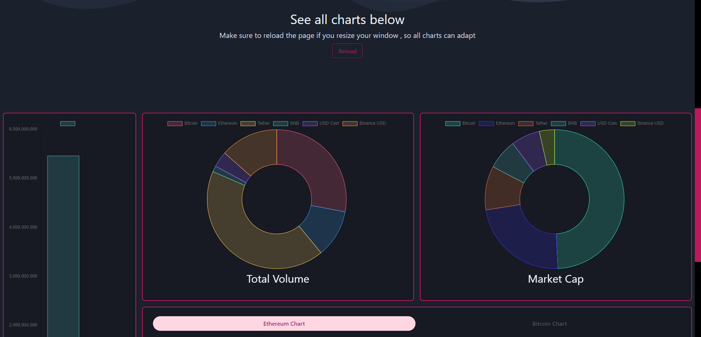

 

  

  <h3 align="center">Dashboard</h3>

  

    An app allowing the visitor to see his nft's, transactions , balances and even more!
     
     
    Warning! - The apps backend is self hosted free on railway meaning its only active rougly 21 days a motnhs (This only affects the login/metamask part) , all other parts - News, Graphs, Exchanges, Data & contact still keep their full functionality. 
    <a href="https://dashboard-app-nine-snowy.vercel.app/">View Page</a>
    
  

     

## Table Of Contents

- [Table Of Contents](#table-of-contents)
- [About The Project](#about-the-project)
- [Built With](#built-with)
- [Images](#images)
- [License](#license)
- [Authors](#authors)

## About The Project

(Now migrated to the Goerli Testnet & self hosted parsed server)

This website can show the user the digital assets he posesses in form of a clear dashboard. It's possible to see NFT's and visit their IPFS uri, see transactions and balances. You can also set ur own username wich will be remembered.

There also 4 tabs in the 'other' section where a user can: access the latest crypto news, all relevant data about a specific coin , see exchanges and all available infos about them, even see graphs and the latest data visualised.

Due to there not being a way to log in on mobile using a crypto wallet, it's recommended to access this site from a PC/Laptop

Build on the Moralis.io API 

Relying also on API's from: CoinGecko & CryptoNews 

## Built With

   

## Images

## License

Distributed under the MIT License. (/client) 

## Authors

* ThatLukaszGuy

